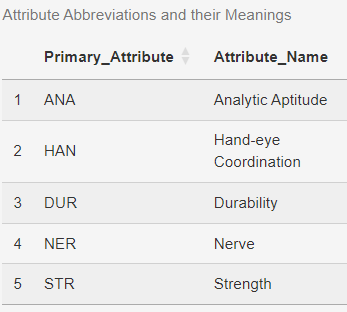

<!-- README.md is generated from README.Rmd. Please edit that file -->

```{r, include = FALSE}
knitr::opts_chunk$set(
  collapse = TRUE,
  comment = "#>",
  fig.path = "man/figures/README-",
  out.width = "100%"
)
```

# rafliassign4

<!-- badges: start -->
<!-- badges: end -->

The goal of rafliassign4 is to see the pattern of olympic medal winners in terms of their peak age range, according to their own sport or eevent.


## Website Link (Documentation)
[Click Here](https://etc5523-2024.github.io/assignment-4-packages-and-shiny-apps-belajaRProgramming0/) 

or 

https://etc5523-2024.github.io/assignment-4-packages-and-shiny-apps-belajaRProgramming0/

## Installation

You can install the development version of rafliassign4 from [GitHub](https://github.com/) with:

``` r
# install.packages("pak")
pak::pak("ETC5523-2024/assignment-4-packages-and-shiny-apps-belajaRProgramming0")
```

## Overview

This package aims to help _Aspiring Athletes,_ _Coaches,_ _Sport Stakeholders,_ _Support System of athletes_ to see the pattern of peak age as an athlete in various Olympics' sport events. The knowledge can be used to plan a better and more accurate strategy to prepare the athletes for the next Olympics.

Here's how you can load the library, after installation:

```{r example}
library(rafliassign4)
## the package name is simple, all in lower case.
```

What is the example of library `rafliassign4` prowess?:

```{r cars, echo=FALSE, warning=FALSE, message=FALSE}
# Load other necessary libraries for plotting
library(ggplot2)
library(dplyr)

# Dataset in this package
data("cleaned_data", package = "rafliassign4")

# Filtered example data (replace as needed)
example_data <- cleaned_data |>
    filter(Top_1_attr == "ANA", Year >= 2000 & Year <= 2016)

# Generate boxplot
ggplot(example_data, aes(x = Sport, y = Age)) +
    geom_boxplot() +
    labs(
        title = "Age Distribution by Sport for ANA Attribute",
        x = "Sport", 
        y = "Age"
    ) +
    theme(axis.text.x = element_text(angle = 45, hjust = 1))

```


There's also a table that explain the meaning of "ANA" attribute and other attributes, like this below:



In the future, we're planning to expand the buttons, filters, type of plots. Stay tune and make sure use the package, thanks...

